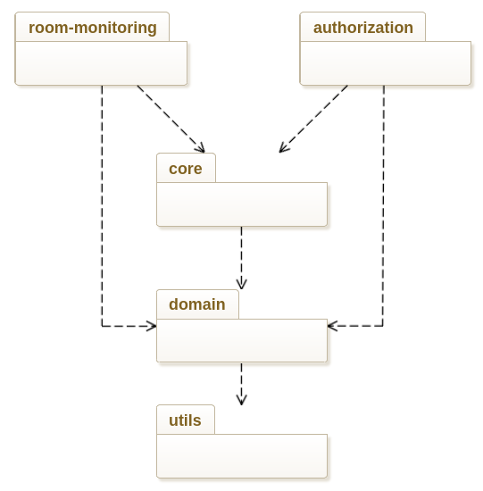
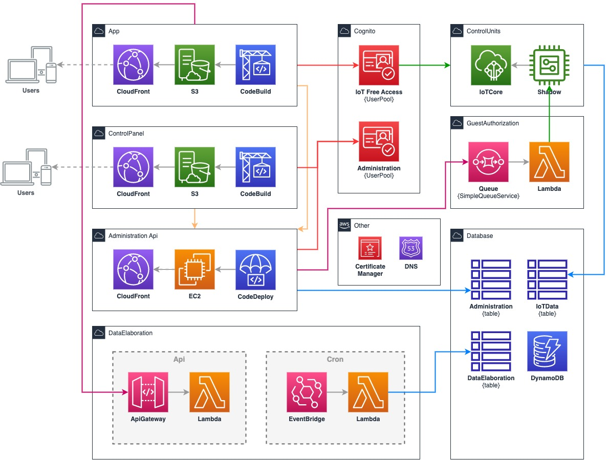

# DevOps

### TODO

- dependabot
- report repo da md a pdf

----


Nella realizzazione di un progetto software, la gestione del codice sorgente e il processo di continuous integration and continuous delivery (CI/CD) sono elementi fondamentali per garantire una efficace collaborazione tra i membri del team e un deployment affidabile e rapido delle funzionalità implementate. 

In questo paragrafo verrà descritta l'organizzazione del progetto e le relative pratiche DevOps, dal lavoro di squadra alla distribuzione del software.

Di seguito una panoramica sull'organizzazione dei vari repository

- [GitHub Actions](#github-actions) Sono state create diverse Composite GitHub Actions per evitare la ridondanza del codice e mantenere i workflow degli altri repository del progetto più leggeri e riutilizzabili.

- [Control Unit](#control-unit): Repository per il software della centralina, che include tutto il codice necessario per la sua funzionalità.

- [Ecotrip](#ecotrip): Repository che gestisce la parte del progetto basata su microservizi sul cloud. Include sottomoduli per ciascun servizio e verrà discussa successivamente.

- Report ...

#### Strategie di Version Control (globali)

Per garantire la qualità e la tracciabilità del codice sviluppato, abbiamo adottato una rigorosa strategia di controllo di versione. 

- Conventional Commit per standardizzare la formattazione dei messaggi di commit e aiutare nella generazione automatica del changelog. 
- Commit firmati, garantendo la responsabilità individuale per il codice inserito.
- Pull basato sul rebase per garantire la pulizia delle storia del repository e una maggiore leggibilità.
- GitFlow come modello di lavoro che prevende l'utilizzo in un'unica branch con la versione stabile del codice e le caratteristiche (_feature_) sviluppate su branch separate ed unite tramite Pull Request. Per il repo che riguarda la parte cloud del progetto (Ecotrip ed i relativi sottomoduli) abbiamo utilizzato anche la branch "dev" come punto di riferimento per la versione in corso del progetto in sviluppo. Inoltre, è anche possibile utilizzare una branch di "staging" se necessario per la preparazione della versione successiva.

## GitHub Actions

### [semantic-release-action](https://github.com/eco-trip/semantic-release-action)

Questa azione segue il paradigma dei "conventional commits" per determinare la prossima versione del progetto, basandosi sulla regola SemVer (Semantic Versioning). In questo modo, la versione del progetto viene automaticamente incrementata in base alla gravità delle modifiche apportate.

È in grado di generare automaticamente un changelog, riepilogando tutte le modifiche apportate dall'ultima versione del progetto. Questo changelog viene quindi utilizzato per creare una nuova release su GitHub, rendendo più semplice e trasparente la gestione delle versioni del progetto.

### [npm-pull-request-action](https://github.com/eco-trip/npm-pull-request-action)

Azione da eseguire durante la creazione di una pull request per repository basati su `npm` (tutti quelli relativi ai microservizi cloud). In particolare, questa azione esegue il lancio di alcuni strumenti di controllo qualità del codice, tra cui:

- Prettier: un formattatore automatico di codice che aiuta a mantenere uno stile coerente ed esteticamente gradevole del codice sorgente.

- ESLint: un linter che analizza il codice sorgente alla ricerca di potenziali problemi di sintassi, buone pratiche e altre regole personalizzabili.

- Test: lanciare gli unit test per verificare che il codice sia corretto e funzionante. Inoltre, la coverage report viene generata per verificare la copertura di test del codice e identificare eventuali aree che potrebbero necessitare di ulteriori test

L'utilizzo di questi strumenti durante la creazione di una pull request consente di individuare eventuali problemi nel codice prima che questo venga integrato nella branch principale, garantendo una maggiore qualità e stabilità del progetto.

### [ci-deploy-action](https://github.com/eco-trip/ci-deploy-action)

Azione utilizzata ogni volta che viene effettuata una release di staging o produzione di uno dei microservizi cloud di ecotrip. Questa azione lancia degli script che compilano i template di AWS SAM, con l'obiettivo di creare o aggiornare l'infrastruttura AWS (Amazon Web Services) tramite Cloud Formation. La "CI Deploy Action" garantisce un deploy rapido e affidabile, rendendo più efficiente il processo di release del progetto senza la necessità di interagire con l'interfaccia grafica di Amazon ed evitando momenti di "down" dei servizi.

### [update-submodules-action](https://github.com/eco-trip/update-submodules-action): 

Questa azione serve per automatizzare il processo di aggiornamento dei submodule all'interno del  repository principale `Ecotrip`. Questa azione viene lanciata ogni volta che una branch di un sottomodulo viene aggiornata con un push di un nuovo commit. In questo modo, il repository principale è sempre aggiornato al commit corretto del sottomodulo (nella relativa branch), mantenendo una relazione consistente tra i diversi componenti del progetto. Questo permette di semplificare il processo di mantenimento del progetto garantendo la coerenza.

## Control Unit 

[rasp-control-unit](https://github.com/eco-trip/rasp-control-unit) repository per il software della centralina, che include tutto il codice necessario per la sua funzionalità.

Come già descritto nelle sezioni precedenti, il progetto relativo alla
centralina si basa su una architettura esagonale, concretamente realizzata come
una _build_ multi-progetto avvalendosi del tool di _build automation_
**Gradle**. Questa soluzione ha permesso di suddividere la complessità del
progetto in moduli interconnessi evitando una struttura monolitica. In linea con
i concetti della _clean architecture_ i moduli sviluppati sono i seguenti:

- `utils`: modulo di livello 0 che contiene strutture dati e algoritmi comuni;
- `domain`: modulo che implementa oggetti(entità) di dominio;
- `core`: modulo che sfrutta gli oggetti di dominio per implementare gli _use
  cases_;
- `room-monitoring`: modulo che implementa la logica di acquisizione ed invio
  dei consumi e fattori ambientali;
- `authorization`: modulo contenente la logica relativa alla gestione del
  _token_ di autorizzazione condiviso con l'utente (_guest_).



I moduli `authorization` e `room-monitoring` possono essere dispiegati
separatamente come servizi distinti.

### Quality assurance

Al fine di mantenere un'elevata qualità del progetto, sono stati adottati i
seguenti strumenti di _quality assurance_:

- **Gradle catalogs**: recente funzionalità di `Gradle` che ha permesso di
  centralizzare la dichiarazione delle dipendenze di progetto in un file
  chiamato catalogo, evitando la loro ripetizione in ciascun modulo. Il fine è
  quello di semplificare l'aggiornamento manuale o automatizzato di versione
  delle dipendenze.
- **checkstyle**: strumento di sviluppo che supporta i programmatori nello
  sviluppo di codice Java che aderisce ad uno standard di codifica. I file di
  configurazione utilizzati risiedono all'interno della directory
  `config/checkstyle`.
- **jacoco**: strumento di coverage di codice Java, lanciato automaticamente a
  fronte dell'esecuzione del task `build` di Gradle. Il _plugin_ può causare il
  fallimento della `build` del progetto nel caso non si raggiunga la soglia di
  _coverage_ prefissata. Infine i risultati della _coverage_ possono essere
  visualizzati attraverso i report html generati da _jacoco_ stesso.
- **spotbugs**: _fork_ del progetto
  [FindBugs](https://findbugs.sourceforge.net/), è un _plugin_ che sfrutta
  analisi statiche al fine di individuare _bugs_ all'interno di codice Java.

Siccome tutti i moduli sviluppati sono progetti Java, si è scelto di applicare a
ciascuno di essi un set di regole comuni definite all'interno di un
**convention-plugin**. Nella pratica si è realizzato un _plugin_ custom
(`java-quality-common-convention.gradle.kts`) all'interno della cartella
`/buildSrc`, successivamente incluso come dipendenza di ciascun modulo, che
oltre a comprendere i _plugin_ `java-library`, `checkstyle`, `jacoco` e
`spotbugs`, per ognuno specifica una configurazione di base, come per esempio la
percentuale minima di _coverage_.

Infine all'interno del file `settings.gradle.kts` sono stati applicati i
_plugin_ `com.gradle.enterprise` e
`org.danilopianini.gradle-pre-commit-git-hooks`. Il primo ha permesso di
generare report in grado di segnalare eventuali problematiche ed inefficienze
all'interno della `build` di Gradle, velocizzando quindi l'attività di
_debugging_. Il secondo invece ha imposto dei vincoli sintattici sui messaggi di
`commit` al fine di rispettare lo schema dei _Conventional commits_.

[TODO] Renovate

### Workflow CI/CD

Allo scopo di mantenere intatta la _build_ durante tutto il processo di
sviluppo, si è realizzato un _workflow_ (`build-and-deploy.yml`) ad hoc tramite
le Github Actions. Questo viene eseguito ogni volta che si effettua una _push_ o
una _pull request_ verso il branch `main`. Il workflow si compone di due _job_:

- `build`: come primo passo rende accessibile il repository al _workflow_
  tramite `actions/checkout@v3`, successivamente sfrutta l'action
  `DanySK/build-check-deploy-gradle-action` così da eseguire un'intera
  _pipeline_ di CI ('build', 'check' e 'clean') sul progetto Gradle ed infine
  effettua l'upload degli artefatti (`.jar`) generati avvalendosi di
  `actions/upload-artifact@v3`
- `release`: dipende dal _job_ precedente poiché necessita degli artefatti
  caricati, infatti adopera `actions/download-artifact@v3` per memorizzare
  questi all'interno del `$GITHUB_WORKSPACE` e successivamente pubblicarli
  mediante l'_action_ custom `eco-trip/semantic-release-action`, precedentemente
  descritta.

Dato che i servizi sviluppati (`control-unit`) eseguiranno solo su determinati
modelli di dispositivi, nello specifico _raspberry_, si è ritenuto non
necessario eseguire il _job_ `build` su una matrice di sistemi operativi, ne
utilizzare diverse versioni di Java.

All'interno del file di _workflow_ vi è il riferimento a un particolare _token_
(`secrets.GH_PACKAGES_TOKEN`) necessario per accedere a _packages_ privati
memorizzati tramite l'omonima funzionalità di Github Packages. Questa soluzione
ha permesso di pubblicare diversi artefatti prodotti a partire da un _fork_
personale della libreria **Pi4J**, creato per aggiungere funzionalità di basso
livello, che soddisfano specifiche esigenze, non ancora ufficialmente
supportate.

## Ecotrip

Ecotrip è il repository che gestisce la parte del progetto basata su microservizi sul cloud. 

Per poter comprendere la sua organizzazione in sotto moduli e le relative DevOps è necessario prima descrivere l'acrhitettura implementata su Amazon Web Services (AWS).

### Architettura AWS

Il progetto Ecotrip si basa sul raccogliere dati da una moltitudine di camere di una moltitudine di hotel, 
analizzarli ed aggregarli al fine di calcolare punteggi da fornire ad una moltitudine di utenti (visitatori e albergatori).

In prima battuta però Ecotrip verrà adottato da un singolo Hotel, è chiara quindi l'esigenza di un'architettura di deployment che consenta di partire con costi ridotti e che permetta una scalabilità orizzontale al bisogno.

Per ottenere questo abbiamo impiegato il paradigma Serverless per le componenti che richiedono una forte scalabilità, come il caricamento e lo stoccaggio dei dati, l'elaborazione e la fornitura verso gli utenti finali. Serverless significa impiegare servizi Cloud che scalano in automatico all'occorrenza, senza alcuna pianificazione prestabilita o intervento umano.



Il servizio `IoT Core` gestisce le centraline IoT e il loro stato attraverso la `copia shadow`. La copia shadow rappresenta una versione virtuale dello stato di ogni centralina IoT, che viene mantenuta sincronizzata con la centralina stessa. Inoltre si preoccupa di ricevere i dati delle centraline attraverso messaggi MQTT e stoccarli attraverso una opportuna regola sulla tabella IoTData.

La `REST API` della parte "Administration" è distribuita attraverso una istanza `EC2`.
Il traffico richiesto per questo componente è relativamente basso in quanto la API "Administration" è soprattutto utilizzata dal pannello di controllo, e si assume che vengano fatte richieste contemporanee da al massimo un utente per hotel, oltre ai visitatori che attraverso le app ricevono limitate informazioni sull'hotel (il nome) e il pernottamento corrente.
Per questo, in questa prima fase, si è scelto di non dotare il servizio API di scaling automatico tramite l'aggiunta di un load balancer.
In futuro la EC2 potrebbe essere sostituire da un servizio API Gateway che consente la completa scalabilità on demand tramite l'impiego di Lambda per ogni endpoint.

Le applicazioni single page (SPA) del pannello di controllo e web app sono distribuite tramite `CloudFront` di Amazon Web Services ed archiviate in un bucket S3. CloudFront è una rete di distribuzione dei contenuti (CDN) su server dislocati in tutto il mondo, il che garantisce una bassa latenza e una consegna veloce per gli utenti, indipendentemente dalla loro posizione geografica.

La generazione del token per i visitatori del microservizio "Guest Authorization" avviene su una `Lambda`, questa si attiva alla ricezione di un messaggio inviato da "Administration" attraverso il servizio di coda `Simple Queue Service` impostato in modalità FIFO (FirstIn-FirstOut). La Lambda si occuperà di aggiornare il valore del token sulla copia shadow del dispositivo fisico, dopo averlo ricercato all'interno del servizio IoT Core attraverso attributi univoci che identificano la centralina di una determinata stanza di un albergo.

Per l'elaborazione dei dati da parte di "Data Elaboration" è stata impiegata un'altra Lambda che si attiva periodicamente ogni 5 minuti attraverso un'attività pianificata di tipo `EventBridge`. Dopo aver eseguito i calcoli questi vengono memorizzati su un apposta tabella "DataElaboration" in DynamoDB.
Attualmente i dati da elaborare vengono processati da un unica istanza della Lambda, ma è possibile strutturare il sistema in modo che ogni hotel avvii la sua istanza di Lambda periodicamente per processare unicamente i suoi dati: questo consente la totale scalabilità computazionale anche per quanto riguarda questo servizio che è il più critico ed oneroso in termini di costo di CPU.
La fornitura dei dati elaborati, come i consumi di un pernottamento o il punteggio sostenibilità richiesti dai visitatori o albergatori, avviene attraverso una REST API realizzata con `API Gateway`: servizio di Amazon che permette ad una API di abbracciare in pieno il paradigma Serverless e quindi piena scalabilità on-demand.

Per quanto riguarda la gestione degli utenti, abbiamo utilizzato `Cognito`. Abbiamo creato due diverse pool di utenti: una per il pannello di controllo "Administration" e un'altra per gli accessi liberi "IoT Free Access". La pool di utenti "Administration" fornisce l'accesso al pannello di controllo per gestire la configurazione e gestione degli alberghi, stanze e prenotazioni. La pool di utenti "IoT Free Access", d'altra parte, consente agli utenti sull'App di visualizzare i dati MQTT in tempo reale della parte IoT senza la necessità di una registrazione.
Cognito emette un token di autorizzazione per ogni sessione di accesso degli utenti, che può essere utilizzato per autorizzare le richieste API. Il token di autorizzazione scade dopo un certo periodo di tempo, ma gli utenti possono ottenere un nuovo token di autorizzazione tramite il token di refresh. Questo sistema a due token garantisce la sicurezza dei dati degli utenti e delle applicazioni, poiché i token di autorizzazione possono essere revocati o scadere in qualsiasi momento, senza che ciò influisca sulla sessione di accesso degli utenti. 

### Development

In vista dell'architettura descritta in precedenza su AWS, abbiamo deciso di creare un repository separato per ogni servizio, al fine di garantirne l'autonomia e la gestione indipendente delle versioni. Tutti i repository sono poi stati incorporati come sottomoduli all'interno di un unico repository contenitore [Ecotrip](https://github.com/eco-trip/Ecotrip).

- [Administraton](https://github.com/eco-trip/Administration)
- [App](https://github.com/eco-trip/App)
- [CP](https://github.com/eco-trip/CP)
- [Cognito](https://github.com/eco-trip/Cognito)
- [DataElaboration](https://github.com/eco-trip/DataElaboration)
- [GuestAuthorization](https://github.com/eco-trip/GuestAuthorization)


Per quanto riguarda lo sviluppo in locale, abbiamo creato un ambiente che riproduce l'architettura descritta in precedenza. 
Utilizzando `Docker Compose`, abbiamo emulato le due Applicazioni (**App** e **ControlPanel**), la **Administration** REST API e il database DynamoDB in container separati. Mentre per quanto riguarda i servizi rimanenti (**Cognito**, **DataElaboration** e **GuestAutorizzazione**) abbiamo utilizzato script che compilano ed avviano template in `SAM` per creare stack in `CloudFormation`, effettuando così il deploy direttamente su AWS dei servizi per il singolo componente del team. 

SAM (`Serverless Application Model`) è un framework opensource che attraverso modelli permette di descrivere l'architettura cloud da creare e gestire. SAM è stato progettato per semplificare la creazione e la gestione di applicazioni serverless utilizzando CloudFormation, senza dover accedere manualmente alle interfacce di gestione di AWS.

Abbiamo optato per questa soluzione , benché fosse possibile emulare l'intera infrastruttura in locale utilizzando l'immagine di Docker di [LocalStack](https://hub.docker.com/r/localstack/localstack) in quanto considerata obsoleta. La soluzione basata su LocalStack, che consente di emulare l'infrastruttura su AWS in locale tramite Docker, è stata scartata perché presenta servizi e versioni più vecchie rispetto a quelle disponibili su AWS ed alcune funzionalità potrebbero non funzionare correttamente o avere limitazioni. Pertanto, abbiamo optato per una soluzione ibrida che ci permetta di sfruttare al massimo i servizi e le funzionalità più recenti disponibili su AWS con la conferma che una volta in "production" tutto funzioni come da aspettative, avendo utilizzato gli stessi esatti ambienti.

Per iniziare a lavorare, sarà sufficiente scaricare il repository principale e avviare uno script di [setup](https://github.com/eco-trip/Ecotrip/blob/release/setup.sh). 

```sh
bash setup.sh
```

Questo script si occupa di preparare le giuste variabili ambiente sul proprio computer locale recuperando i segreti archiviati su AWS Secret manager eliminando la necessità di hardcodare elementi sensibili come password o chiavi API, garantendo una maggiore sicurezza del codice e una gestione più efficiente di questi elementi critici. Lo script gestirà anche l'installazione dei pacchetti npm e la predisposizione del servizio Cognito su per lo sviluppatore, garantendo che ogni membro del team possa lavorare sul progetto in modo autonomo.

Per poter eseguire lo Script ed avere accesso ai segreti su AWS servirà avere la `cli` installata e configurata con il profilo Amazon corretto. Per utteriori dettagli e requistiti seguire il [README](https://github.com/eco-trip/Ecotrip).

In seguito al completamento del processo di setup, sarà sufficiente eseguire il seguente comando

```sh
docker compose up
```

A questo punto lo sviluppatore si ritroverà buona parte del sistema emaulato ed all'occorrenza potrà avviare anche una propria istanza dei servizi "DataElaboration" e "GuestAuthorization" (di default non sono creati) attraverso [script di deploy](#script-di-deploy).

Questo processo viene effettuato in modo specifico per ogni singolo membro del team, garantendo così un ambiente di sviluppo personalizzato e indipendente.

### Workflow CI/CD

In fase di staging e production, il processo di deployment viene completamente automatizzato tramite le `GitHub Action` sulle apposite branch. Queste azioni avviano i relativi [script di deploy](#script-di-deploy) che attraverso i template SAM creano e mantengono aggiornata l'infrastruttura su AWS, garantendo così un processo di distribuzione affidabile, efficiente e privo di errori. Il sistema di deploy automatico garantisce che il progetto sia sempre allineato alla versione più recente.

L'ambiente di staging è una replica fedele dell'ambiente di produzione, che viene utilizzato per effettuare test e verifiche prima di effettuare eventuali modifiche al sistema in produzione. Questo ambiente separato permette di effettuare prove senza influire sul funzionamento e sui dati del sistema in produzione, garantendo così la stabilità e la sicurezza dell'intero ecosistema.

#### Script di deploy

Abbiamo standardizzato l'utilizzo di una cartella `deploy` all'interno di ogni repository del progetto per facilitare il processo di deploy dell'infrastruttura su AWS. In questa cartella è presente uno script specifico per il **deploy** e uno per il **destroy** dell'infrastruttura. Lo script utilizza i segreti presenti su AWS, crea il template SAM e avvia lo stack Cloud Formation. La variabile "-e" permette di specificare se l'ambiente è "dev", "staging" o "production". Questi script possono essere eseguiti manualmente dalla console, se si hanno i permessi, o automaticamente dalle GitHub Actions.


	
