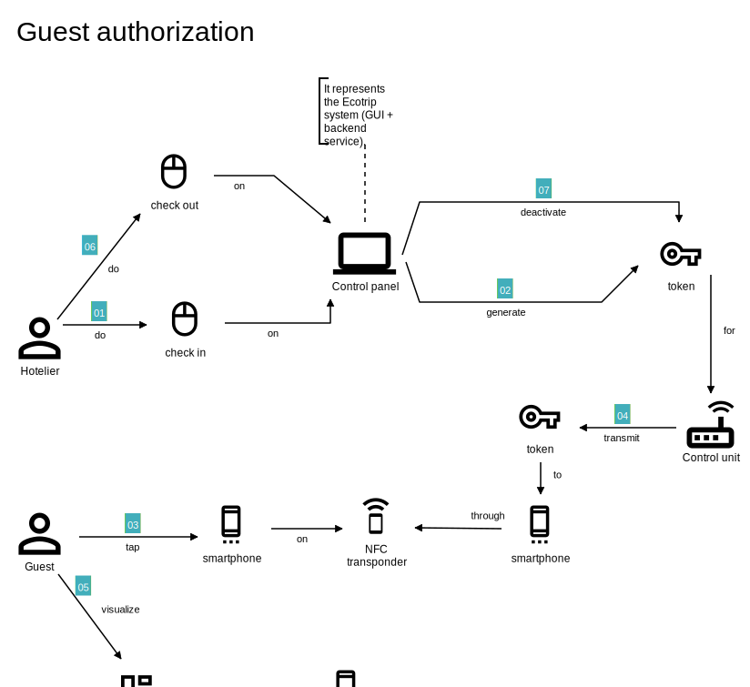
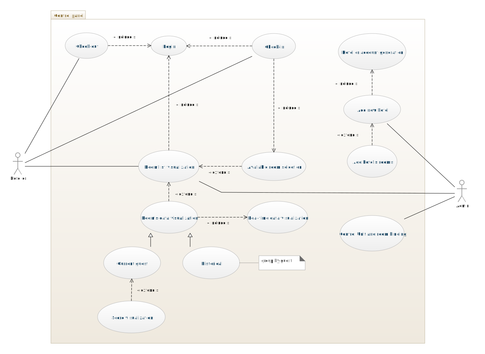
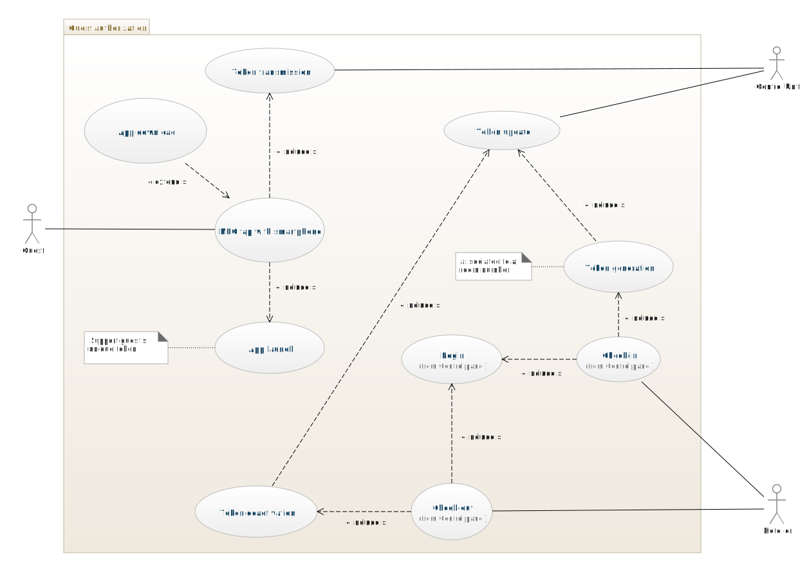
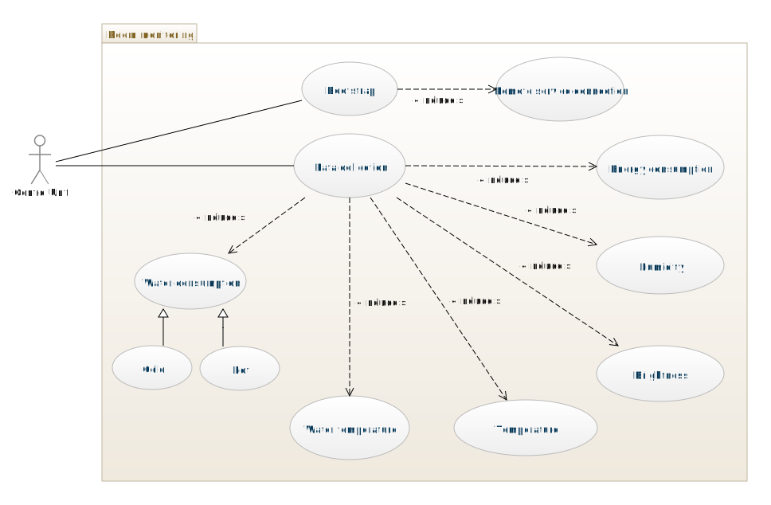
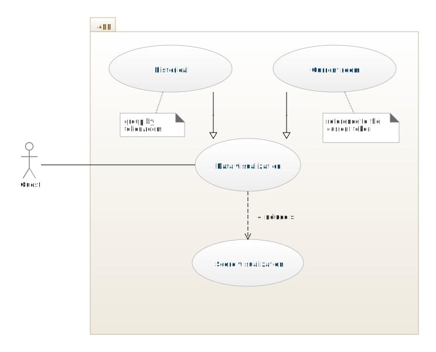
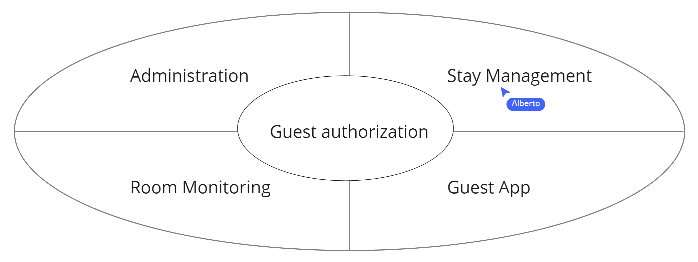
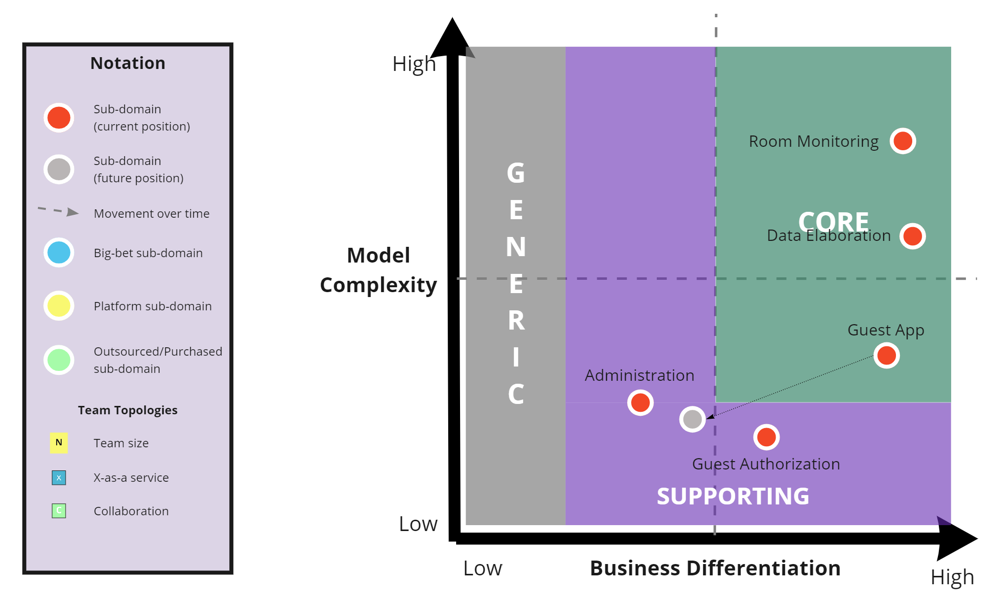

# knwoledge krunching

Dalle prime interazioni con l'esperto di dominio lato cliente, si è notato che
questo aveva ben chiari gli obiettivi finali del progetto, ma abbiamo dovuto
fornire consulenza tecnica, tecnologica e strategica per definire insieme le
funzionalità da includere subito in Ecotrip e quelle invece lasciate a sviluppi
futuri.

Dopo alcune sessioni di knowledge crunching siamo giunti al seguente testo
condiviso.

Il gestore di un hotel, l'albergatore, può supportare il sistema Ecotrip
installando la centralina in una o più camere. Una centralina comprende diversi
sensori cablati che andranno opportunamente sistemati all'interno della camera.
I sensori previsti per il primo prototipo di Ecotrip sono:

- 1 sensore per rilevare il consumo elettrico per l'intero circuito luci + 1 per
  il circuito prese
- 1 flussometro per misurare il consumo d'acqua fredda + 1 per l'acqua calda
- 1 termometro per misurare la temperatura dell'acqua fredda + 1 per l'acqua
  calda
- 1 sensore di luminosità per ogni finestra, per rilevare se la tenda è aperta o
  chiusa
- 1 sensore di temperatura ambientale
- 1 sensore di umidità ambientale

La centralina comprende anche un insieme di sensori per identificare se l'ospite
è presente nella camera o meno: questo specifico aspetto viene lasciato per
sviluppi successivi al primo prototipo, il quale "rileverà" la presenza
dell'ospite attraverso un semplice interruttore meccanico. Nel prodotto finale
prevediamo invece due possibilità:

- nel caso in cui la camera dispone già di una centralina che accende e spegne
  l'impianto elettrico in base all'inserimento della chiave da parte
  dell'ospite, allora la nostra centralina identificherà la presenza in base
  all'attivazione degli impianti.
- negli altri casi doteremo la camera di un sensore per identificare se la porta
  di accesso è aperta/chiusa e di uno o più sensori di presenza da installare a
  soffitto, in modo da stabilire se l'ospite è entrato o uscito ogni volta che
  la porta viene chiusa.

Una volta insallata, la centralina viene connessa alla rete wifi dell'hotel in
modo da consentirle l'accesso ad Internet, inoltre viene configurata abbinandola
al numero di camera. Dopo la configurazione, la centralina campionerà ogni X
secondi i dati da tutti i sensori e li invierà sul cloud: deve essere possibile
stabilire l'origine dei dati nei termini di hotel e camera. Infine il sistema
deve prevedere meccanismi di controllo dello stato (centralina online/offline) e
di manutenzione da remoto.

Gli amministratori di Ecotrip tramite un pannello di controllo possono gestire
la lista degli hotel, le loro camere, visualizzare lo stato delle centraline
installate ed infine registrare l'account dell'albergatore.

L'albergatore potrà quindi accedere al pannello di controllo e, per ciascuna
delle sue camere, visualizzare i dati istantanei raccolti dai sensori ed
indicare i momenti di check-in e check-out di un ospite: quest'ultima funzione
manuale, in ottica di sviluppo futuro, sarà automatizzabile con la connessione
del pannello di controllo al gestionale dell'albergo.

Per ogni soggiorno, cioè il periodo tra il check-in ed il check-out dell'ospite,
saranno visualizzabili oltre che i dati sintetizzati, anche il consumo totale di
CO2 ed il punteggio "sostenibilità" ottenuto. Il calcolo della CO2 viene fatto
considerando il consumo energetico, comprensivo di quello stimato per il
riscaldamento della camera e dell'acqua, e la provenienza dell'energia usata
dall'hotel. Il punteggio "sostenibilità" tiene conto, non solo della CO2 totale,
ma anche del comportamento tenuto dall'ospite durante la sua permanenza: ad
esempio deve essere penalizzato il fatto di uscire dalla camera lasciando in
periodo estivo di giorno tende aperte e condizionatore acceso a pieno regime.

L'ospite attraverso l'app Ecotrip può visualizzare i dati del suo soggiorno
corrente e di quelli passati, comprendenti sia i dati sintetizzati, che il
consumo CO2 ed il punteggio "sostenibilità" aggiornati in tempo reale.

Al fine di permettere all'ospite di collegarsi facilmente ed autonomamente ai
dati del proprio soggiorno, a quest'ultimo viene associato un token univoco,
cioè un codice casuale generato al momento del check-in, ed inviato alla
centralina della relativa camera. Alla centralina è collegato un transponder NFC
che deve essere installato nella camera in modo che sia visibile agli ospiti,
magari identificabile con il logo di Ecotrip. Quando un ospite avvicina al
transponder della centralina il proprio smartphone provvisto di NFC, questo
riceve indicazioni per avviare automaticamente l'app Ecotrip con il token come
parametro: da questo momento l'app memorizzerà il token e permetterà di
visualizzare i dati del soggiorno richiedendoli ad un servizio remoto.
L'operazione di collegamento token-app può essere fatta una sola volta e solo
prima del check-out, questo garantisce sicurezza e privacy riducendo il rischio
di violazioni di accesso ai dati.

Al check-out è possibile calcolare uno sconto in base alla CO2 risparmiata
rispetto a valori obiettivo e/o in base al punteggio "sostenibilità" ottenuto.

## User stories

Tra le user stories identificabili, quelle reltive al checkin/checkout e
autorizzazione dell'ospite mediante token risultano essere poco banali, le
abbiamo quindi approfondite con l'esperto di dominio.

In ordine:

- l'albergatore esegue il checkin dell'ospite impostando un nuovo soggiorno per
  una camera
- un nuovo token relativo al soggiorno viene generato
- il token viene inviato alla centralina della camera
- l'ospite, una volta entrato nella camera, esegue il tap con il suo cellulare
  sul transponder NFC della centralina
- la centralina comunica al cellulare di aprire l'app indicando il token del
  soggiorno
- l'ospite visualizza tramite app i dati del soggiorno

## Use cases

Di seguito riassumiamo i casi d'uso raggruppati in base al contesto

## Subdomains

Abbiamo identificato 4 sottodomini del dominio.

Administration: comprende le funzionalità di amministrazione generale mediante
apposito pannello di controllo, ovvero la configurazione di nuovi hotel, account
utente/hotelier e centraline. Comprende anche la gestione dei soggiorni con
check-in e check-out da parte dell'hotelier.

Room Monitoring: comprende i sistemi e la sensoristica necessari per la raccolta
e lo stoccaggio in cloud dei dati delle stanze degli hotel.

Data Elaboration: comprende il calcolo della stima dei consumi C02 e del
puntenggio "sostenibilità" relativo ai soggiorni.

Guest Authorization: include il processo di generazione del token per un nuovo
soggiorno ed il suo trasferimento alla centralina e successivamente allo
smartphone mediante transponder NFC, permettendo così all'ospite di accedere ai
dati del suo soggiorno.

Guest App: include la visualizzazione dei dati del soggiorno tramite applicativo
fruibile dagli ospiti, inoltre implementa gli aspetti di gamification.

Di seguito il core domain chart dove mostriamo che secondo la nostra analisi i
sottodomini centrali di ecotrip sono il monitoraggio della stanza,
l'elaborazione dati e l'app per l'ospite. Consideriamo però l'app uno short-term
core, in quanto il concetto di gamification potrebbe essere ripreso da altri in
altri modi e quindi perdere di differenziazione nel mercato.

