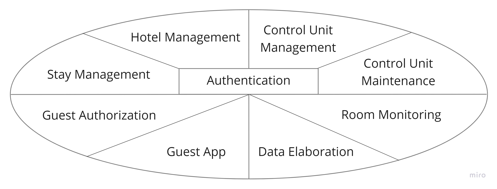
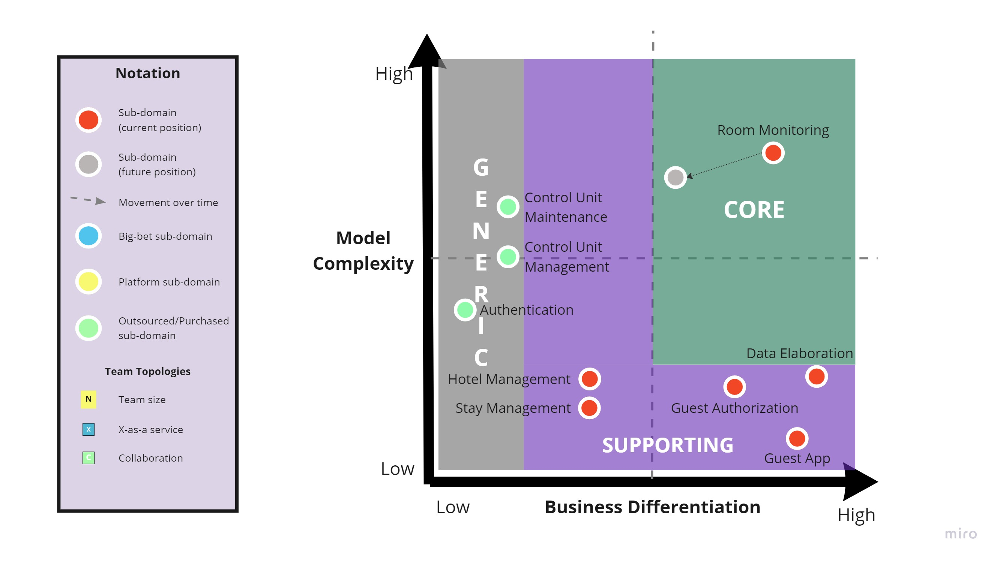

# Knowledge crunching

Dalle prime interazioni con l'esperto di dominio lato cliente, si è notato che
questo aveva ben chiari gli obiettivi finali del progetto, ma abbiamo dovuto
fornire consulenza tecnica, tecnologica e strategica per definire insieme le
funzionalità da includere subito in Ecotrip e quelle invece lasciate a sviluppi
futuri.

Dopo alcune sessioni di knowledge crunching siamo giunti al seguente testo
condiviso.

Il gestore di un hotel, l'albergatore, può supportare il sistema Ecotrip
installando la centralina in una o più camere. Una centralina comprende diversi
sensori cablati che andranno opportunamente sistemati all'interno della camera.
I sensori previsti per il primo prototipo di Ecotrip sono:

- 1 sensore per rilevare il consumo elettrico
- 1 flussometro per misurare il consumo d'acqua fredda + 1 per l'acqua calda
- 1 termometro per misurare la temperatura dell'acqua fredda + 1 per l'acqua
  calda
- 1 sensore di luminosità per ogni finestra, per rilevare se la tenda è aperta o
  chiusa
- 1 sensore di temperatura ambientale
- 1 sensore di umidità ambientale

La centralina comprende anche un insieme di sensori per identificare se l'ospite
è presente nella camera o meno: questo specifico aspetto viene lasciato per
sviluppi successivi al primo prototipo. Nel prodotto finale prevediamo invece
due possibilità:

- nel caso in cui la camera dispone già di una centralina che accende e spegne
  l'impianto elettrico in base all'inserimento della chiave da parte
  dell'ospite, allora la nostra centralina identificherà la presenza in base
  all'attivazione degli impianti.
- negli altri casi doteremo la camera di un sensore per identificare se la porta
  di accesso è aperta/chiusa e di uno o più sensori di presenza da installare a
  soffitto, in modo da stabilire se l'ospite è entrato o uscito ogni volta che
  la porta viene chiusa.

Una volta installata, la centralina viene connessa alla rete wifi dell'hotel in
modo da consentirle l'accesso ad Internet, inoltre viene configurata abbinandola
al numero di camera. Dopo la configurazione, la centralina campionerà ogni X
secondi i dati da tutti i sensori e li invierà sul cloud: deve essere possibile
stabilire l'origine dei dati nei termini di hotel e camera. Infine il sistema
deve prevedere meccanismi di controllo dello stato (centralina online/offline) e
di manutenzione da remoto.

Gli amministratori di Ecotrip tramite un pannello di controllo web possono
gestire la lista degli hotel, le loro camere, visualizzare lo stato delle
centraline installate ed infine registrare l'account dell'albergatore.

L'albergatore potrà quindi accedere al pannello di controllo e, per ciascuna
delle sue camere, visualizzare i dati istantanei raccolti dai sensori ed
indicare i momenti di check-in e check-out di un ospite: quest'ultima funzione
manuale, in ottica di sviluppo futuro, sarà automatizzabile con la connessione
del pannello di controllo al gestionale dell'albergo.

Per ogni soggiorno, cioè il periodo tra il check-in ed il check-out dell'ospite,
saranno visualizzabili oltre che i dati sintetizzati, anche il consumo totale di
CO2 ed il punteggio "sostenibilità" ottenuto. Il calcolo della CO2 viene fatto
considerando il consumo elettrico utilizzato per alimentare la stanza, compreso
quello per il suo riscaldamentoe e quello stimato per riscaldare l'acqua: si
considera infatti che negli USA le camere vengono riscaldate unicamente con
pompa di calore e non si utilizza gas/metano. Per effettuare il calcolo CO2 deve
essere specificato per ciascun hotel il costo dell'energia nei termini di
CO2/Kilowatt. Il punteggio "sostenibilità" tiene conto, non solo della CO2
totale, ma anche del comportamento tenuto dall'ospite durante la sua permanenza.
Alcuni comportamenti penalizzanti sono:

- il fatto di uscire dalla camera lasciando in periodo estivo di giorno tende
  aperte e condizionatore acceso a pieno regime.
- usare eccessiva acqua

L'ospite attraverso l'app Ecotrip può visualizzare i dati del suo soggiorno
corrente e di quelli passati, comprendenti sia i dati sintetizzati, che il
consumo CO2 ed il punteggio "sostenibilità" aggiornati in tempo reale.

Al fine di permettere all'ospite di collegarsi facilmente ed autonomamente ai
dati del proprio soggiorno, a quest'ultimo viene associato un token univoco,
cioè un codice casuale generato al momento del check-in, ed inviato alla
centralina della relativa camera. Alla centralina è collegato un transponder NFC
che deve essere installato nella camera in modo che sia visibile agli ospiti,
magari identificabile con il logo di Ecotrip. Quando un ospite avvicina al
transponder della centralina il proprio smartphone provvisto di NFC, questo
riceve indicazioni per avviare automaticamente l'app Ecotrip con il token come
parametro: da questo momento l'app memorizzerà il token e permetterà di
visualizzare i dati del soggiorno richiedendoli ad un servizio remoto.
L'operazione di collegamento token-app può essere fatta una sola volta e solo
prima del check-out, questo garantisce sicurezza e privacy riducendo il rischio
di violazioni di accesso ai dati.

Al check-out è possibile calcolare uno sconto in base alla CO2 risparmiata
rispetto a valori obiettivo e/o in base al punteggio "sostenibilità" ottenuto.

## Ubiquitous Language
Allo scopo di definire un linguaggio comune che eviti fraintendimenti e
assunzioni, si è realizzato un glossario (Tabella \ref{my_table}) che esplicita
l'intera terminologia di business.

Table: (Glossario) \label{glossary}
| **Termine** | **Definizione** | **Sinonimi** |
|:---:|---|---|
| Hotel | singola struttura che richiede l'installazione del servizio Ecotrip |  |
| Room | singola stanza di un `hotel` di cui è necessario monitorare consumi e parametri ambientali  | Stanza |
| Floor | piano relativo alla `stanza` | Piano della stanza |
| Number | numero che identifica univocamente una `stanza` all'interno di un `hotel`  | Numero di stanza |
| Stay | soggiornamento di un cliente in un `hotel` in relazione ad una specifica `stanza` | Soggiornamento |
| Guest | cliente di un `hotel` che verrà registrato all'interno del sistema e che causerà la produzione di un nuovo `token` | Cliente |
| Token | valore alfanumerico univico all'interno del sistema Ecotrip. Sarà generato automaticamente a partire dal `numero della stanza` e dall'identificativo dell'`hotel` |  |
| CO2 | rappresenta il valore di anidride carbonica prodotto da una stanza, calcolata sulla base dei consumi | Anidride carbonica |
| Score | valore numerico calcolato sulla base dei consumi di un certo `guest` in relazione a un certo `stay` | Punteggio |
| Synthetic Data |  |  |
| Formula | equazione utilizzata per il calcolo dello `score` |  |
| Control Unit | centralina installata in una specifica `stanza` di `hotel`. Raccoglie i dati sui consumi e fattori ambientali sfruttando `sensori` | Centralina |
| Boostrap | processo di inizializzazione necessario per avviare la `centralina` e connetterla al servizio esterno | Inizializzazione |
| Status | stato della `centralina` utile per segnalare la presenza di eventuali malfunzionamenti | Stato della centralina |
| Connection | fase successiva al `boostrap` che consente di recuperare il `token` corrente dal servizio esterno |  |
| Sensor | sensore installato all'interno di una `stanza`, e connesso alla `centralina`, addetto al rilevamento di consumi (es. corrente, flusso d'acqua) o fattori ambientali (es. temperatura) | Sensore |
| Collected Data | aggregato di dati prodotto dai rilevamenti relativi a una specifica `stanza`  |  |
| Consumption | consumi rilevabili, prodotti da un `cliente` in una `stanza` (es. corrente e flusso d'acqua) | Consumi |
| Ambient | fattori ambientali rilevabili all'interno di una `stanza` (es. temperatura) |  |
| RoomTemperature | valore numerico che indica la temperatura di una specifica `stanza` in °C | Temperatura della stanza |
| Humidity | valore numerico che indica l'umidità di una specifica `stanza` in % | Umidità |
| Brightness | valore numerico che indica l'illuminazione di una specifica `stanza` in Lux | Luminosità |
| Energy | descrive la categoria di consumi relativi alla corrente elettrica  |  |
| Voltage | tensione elettrica misurata in V | Tensione |
| Resistance | resistenza elettrica calcolta in Ohm | Resistenza |
| Current | corrente elettrica calcolata in Amp | Corrente |
| Waterflow | flusso d'acqua calcolato in litri al minuto | Flusso d'acqua |
| Thermostat | sensore installato nei tubi d'acqua per misurarne la temperatura dell'acqua | Termistore, NTC |
| WaterTemperature | valore numerico che indica la temperatura dell'acqua in °C |  |
| Cold | identifica una temperatura dell'acqua sotto i 15 gradi |  |
| Hot | identifica una temperatura dell'acqua sopra i 15 gradi |  |
| Steinhart B formula | formula utilizzata dal `NTC` per il calcolo della temperatura al variare della resistenza |  |
| ADC | convertitore di segnale analogico digitale | Convertitore |
| Channel | canale analogico del convertitore |  |
| Address | indirizzo virtuale del `sensore` analogico collegato all'`ADC` |  |
| NTF Transponder | lettore NFC utilizzato per condividere il `token` con lo smartphone del `cliente` |  |
| Control Panel | pannello di controllo utilizzato dal gestore dell'albergo per registrare lo `stay` e visualizzare i dati raccolti dalle diverse `stanze`  | Pannello di controllo |
| Account | utente relativo ad un gestore d'albergo opportunamente registrato all'interno del sistema oppure all'amministratore |  |
| Login | azione che permete ad un gestore o all'amministratore di accedere la sistema specificando _username_ e password |  |
| Role | discrimina la categoria di utente memorizzato all'interno del sistema | Ruolo |
| Admin | amministratore di sistema  | Amministratore |
| Hotelier | gestore di un hotel che, tra le altre mansioni, si occupa di effettuare il `check-in` e `check-out` di un `guest` | Gestore d'albergo |
| Check-in | descrive l'inizio dello `stay` di un `guest` |  |
| Check-out | descrive il termine dello `stay` di un `guest`  |  |
| App | applicazione frontend utilizata dal `guest` per visualizzare il proprio `score` |  |
| Tap | definisce l'avvicinamento dello smartphone di un `guest` con la `control unit` al fine di ricevere il `token` |  |
| Gamification | tecnica di miglioramento della UX per il `guest` |  |

L'_ubiquitous language_ dovrebbe essere definito a livello di singolo _bounded context_ ma, data l'assenza di conflitti (stesso nome per concetti diversi), si è optato per un unica tabella globale.

## User stories

Tra le user stories identificabili, quelle reltive al checkin/checkout e
autorizzazione dell'ospite mediante token risultano essere poco banali, le
abbiamo quindi approfondite con l'esperto di dominio.

In ordine:

- l'albergatore esegue il checkin dell'ospite impostando un nuovo soggiorno per
  una camera
- un nuovo token relativo al soggiorno viene generato
- il token viene inviato alla centralina della camera
- l'ospite, una volta entrato nella camera, esegue il tap con il suo cellulare
  sul transponder NFC della centralina
- la centralina comunica al cellulare di aprire l'app indicando il token del
  soggiorno
- l'ospite visualizza tramite app i dati del soggiorno

## Use cases

Di seguito riassumiamo i casi d'uso raggruppati in base al contesto

## Subdomains

Abbiamo identificato 9 sottodomini.

**Hotel Management**: comprende le funzionalità svolte dall'amministratore Ecotrip
che riguardano la configurazione di nuovi hotel con le camere.

**Stay Management**: comprende la gestione dei soggiorni con le funzioni di check-in
e check-out da parte dell'hotelier.

**Authentication**: comprende sia l'autenticazione utenti quali amministratore
Ecotrip e hotelier richiesta per l'utilizzo dei servizi come Hotel e Stay
Management, che la possibilità di registrare gli account per gli hotelier.

**Control Unit Management**: comprende la gestione delle centraline installate con
la possibilità di verifica dello stato e di abbinamento alle camere.

**Control Unit Maintenance**: comprende il sistema per la manutenzione da remoto
delle centraline installate.

**Room Monitoring**: comprende il sistema per il campionamento dei dati dai sensori
della centralina e lo stoccaggio in un servizio cloud.

**Data Elaboration**: comprende il sistema per il calcolo della stima dei consumi
C02 e del puntenggio "sostenibilità" relativo ai soggiorni, a partire dai dati
collezionati.

**Guest Authorization**: include il processo di generazione del token per un nuovo
soggiorno ed il suo trasferimento alla centralina e successivamente allo
smartphone mediante transponder NFC, permettendo così all'ospite di accedere ai
dati del suo soggiorno.

**Guest App**: include la visualizzazione dei dati del soggiorno tramite applicativo
fruibile dagli ospiti, inoltre implementa gli aspetti di gamification.

Di seguito il core domain chart dove mostriamo che secondo la nostra analisi il
sottodominio centrale di ecotrip è Room Monitoring: riteniamo che la raccolta
dati pensata specificamente per le camere di hotel rappresenti un certo grado di
innovazione oltre che presentare una certa complessità a livello di modello.
Altri sottodomini fortemente diffarenzianti a livello di mercato sono Data
Elaboration e Guest App: riteniamo infatti che i concetti innovativi del dominio
siano rappresentati, oltre che dalla raccolta dati, anche e soprattutto dal modo
con cui vengono calcolati i punteggi sostenibilità e dall'app, la quale si
occupa di trasmettere l'idea con concetti di gamification. Tuttavia questi sono
poco complessi a livello di model per questo li identifichiamo come sottodomini
di supporto.

I sottodomini Control Unit Management e Maintenance sono di tipo generico in
quanto rappresentano servizi per IoT offerti in modo esaustivo dai grandi cloud
provider: ad esempio tramite AWS IoT Core è possibile gestire le centraline
abbinandole con dei tag alle camere degli hotel, verificarne lo stato ed
effettuare manutenzione remota. Stessa cosa vale per il sottodominio
Authentication che può essere delegato ad un servizio esterno come AWS Cognito.

Infine, sottodomini Hotel Management, Stay Management e Guest Authorization sono
considerati di supporto.

