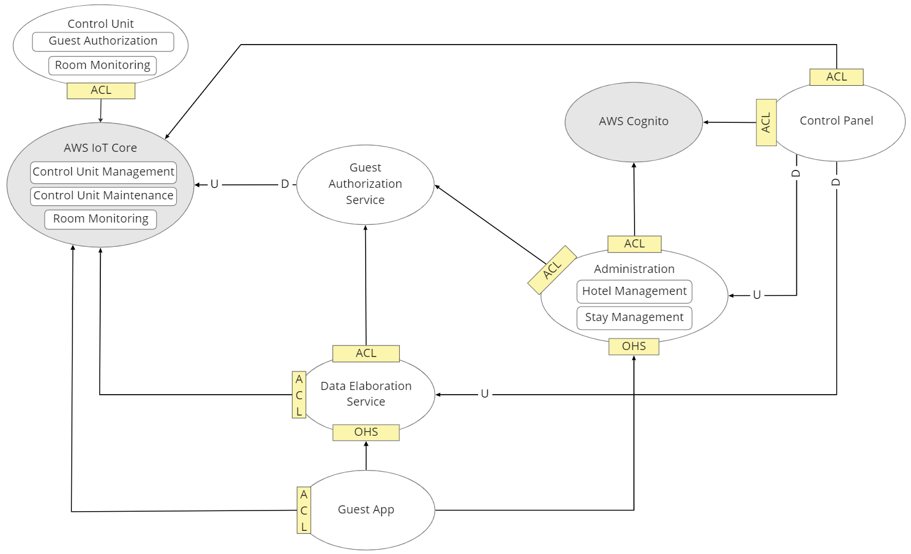

# Strategic design

Analizzando i sottodomini abbiamo identificato i componenti fisici e logici del
sistema, andando così a definire i bounded-context e le loro interazioni.

## Bounded context

- che cos'è un BC
- perchè decidiamo qui il servizio esterno

### Administration

Per quanto concerne Hotel Management e Stay Management abbiamo deciso di
definirli in un unico bounded context Administration: in questo modo i due
singoli sottodomini rappresentano componenti logici del servizio.

In questo caso abbiamo evitato la logica a microservizi pura, andando cioè a
creare un boundex context per ciascun sottodominio, in quanto:

- i singoli servizi hanno API molto ridotte
- non ci sono conflitti a livello di domain language
- Hotel Management avrà un numero di richieste molto basso e lo scaling del
  servizio può essere dimensionato pensando unicamente a Stay Management
- ci sarà un unico team a gestire il singolo bounded context

Questa strategia a nostro avviso ci consente di semplificare sviluppo e ridurre
costi di deployment.

Infine, poichè è richiesto che il pannello di controllo sia fruibile via web
andiamo ad applicare il backend-for-frontend pattern: Administration si occuperà
di fornire una RESTful API ad uso del front-end che sarà descritto in seguito.

### AWS Cognito:

Per il sottodominio generico Authentication definiamo il bounded context AWS
Cognito che verrà affidato all'omonimo servizio Amazon.

### Control Panel

L'interfaccia utente di Administration e Authentication sarà separata in un
bounded context a parte che rappresenta un progetto con framework React. Qui
saranno quindi definiti, oltre che il layout generale, i diversi componenti che
realizzeranno la logica di business front-end per i servizi Hotel Management,
Stay Management ed Authentication. Inoltre l'interfaccia dovrà visualizzare i
dati di Room Monitoring, Data Elaboration e lo stato delle centraline servito da
Control Unit Management, andando quindi a interagire con i relativi bounded
context descritti in seguito.

### AWS IoT Core

Con il bounded context AWS IoT Core, affidato all'omonimo servizio Amazon,
includiamo i sottodomini Control Unit Management, Control Unit Maintenance e lo
storage cloud dei dati generati da Room Monitoring. AWS IoT Core di Amazon
permette di gestire agevolmente tutto questo tramite un apposito pannello di
controllo, dove è anche possibile abbinare le centraline alle stanze attraverso
tagging. Infine, tramite un apposita Rest API è possibile ottenere per ogni
centralina i dati caricati, verificarne lo stato ed inviare comandi:
quest'ultima possibilità può essere utilizzata per inviare il token di un
ospite.

### Guest Authorization Service

Il sottodominio Guest Authorization è realizzabile con due sistemi distinti. Il
primo bounded context, che chiameremo Guest Authorization Service, si occupa
della generazione del token quando viene creato un nuovo soggiorno in Stay
Management, e del suo trasferimento alla centralina attraverso AWS IoT Core.

L'altro sistema necessario al processo di Guest Authorizzation è incluso come
modulo nel software della centralina.

### Control Unit

Predisponiamo un unico bounded context per il software della centralina, il
quale è costituito da due moduli: uno che realizza le funzioni del sottodiminio
Room Monitoring e l'altro quelle di Guest Authorization per quanto concerne la
gestione del transponder NFC.

Si è evitato di creare due software indipendenti poiché i sottodimini coinvolti
non presentano conflitti di _domain language_, devono avere lo stesso ciclo di
vita e un unico deployment per semplificare la configurazione e manutenzione
delle centraline.

### Guest App

Per il sottodominio Guest App definiamo un omonimo bounded context

## Context map

Di seguito vengono descritte le relazioni tra i bounded context.

