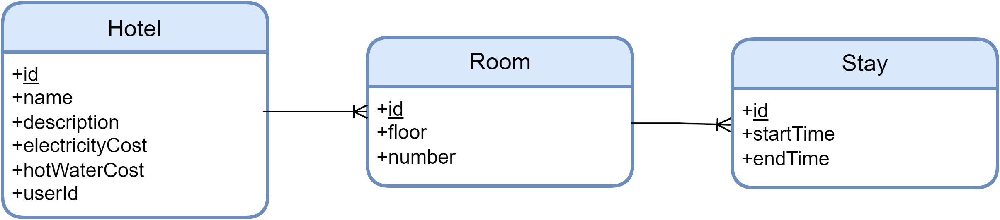

# Tactical Design

All'interno della seguente sezione vengono presentate tutte le scelte intraprese
relative al _tactical design_. In particolare, queste sono state suddivise a
livello di _bounded context_ al fine di dettagliarne l'implementazione della
_business logic_, l'architettura e il pattern di comunicazione.

## Control Unit

Come già anticipato le funzionalità della _control unit_ sono state raccolte in
due _sub domain_ distinti: _Guest Authorization_ e _Room Monitoring_. Il primo
definisce la gestione del _token_ di autorizzazione mentre la seconda descrive
la logica di calcolo ed invio dei consumi.

Data la natura _core_ del _bounded context_ e un discreto numero di concetti di
dominio da modellare, ci si è avvalsi del _domain model pattern_. Infatti la
_business logic_ viene espressa in termini di:

- _value objects_: utilizzati per rappresentare il _token_ di autorizzazione e
  le varie tipologie di misurazioni (temperatura, corrente, ecc.);
- _entities_: sfruttate per definire il concetto di rilevazione (_detection_) e
  sensore;
- _domain services_: impiegati per modellare la logica di persistenza del
  _token_ corrente (`TokenRepository`).

Il pattern adottato prevederebbe altri elementi costitutivi, come gli
_aggregators_, ma il loro impiego non è stato necessario dato il livello di
complessità del dominio.

Inoltre la struttura del _bounded context_ è sostenuta da una architettura
esagonale ([@fig:cleanarc]), la quale garantisce caratteristiche quali:

- _modularità_: le regole operative possono essere collaudate indipendentemente
  dalla UI, dal database o qualsiasi altro elemento esterno;
- _indipendenza dai framework_: la scelta dei _framework_ ricade solamente
  sull'ultimo strato dell'architettura, così da utilizzare questi come semplici
  strumenti evitando di sottostare a specifici vincoli;
- _indipendenza dal database_: la _business logic_ non è legata nè a un singolo
  database nè ad una specifica tipologia.

Tutto questo è reso possibile dal rispetto della _"regola della dipendenza"_, la
quale sostiene che le dipendenze presenti nel codice sorgente devono puntare
solo all'interno, verso le politiche di alto livello. Nella pratica, alcune
classi degli strati più esterni vanno ad implementare interfacce definite in
quelli più interni. Infatti, la comunicazione con gli altri _bounded context_
avviene per mezzo di _adapter_ (interfacce) descritti internamente ed
opportunamente concretizzati nell'ultimo livello. Inoltre questa tipologia di
architettura ha consentito di delineare un confine netto tra i due _sub domain_,
separando questi in due moduli distinti.

{#fig:cleanarc}

Si può quindi dire che la progettazione della _control unit_ è il risultato
della combinazione della terminologia definita dall'_ubiquitous language_, con
gli elementi del _domain model pattern_ ed i concetti dell'architettura
esagonale ([@fig:cu-uml]). Di particolare interesse è stato definire lo strato
_core_ mediante casi d'uso, questi hanno permesso di orchestrare i flussi di
dati da e verso le entità, rimanendo aderenti agli schemi elaborati durante la
fase di _knowledge crunching_. I casi d'uso possono essere riassunti in:

- `EnvironmentUseCases`: racchiude la logica relativa al rilevamento dei fattori
  ambientali tramite i sensori di temperatura dell’acqua, luminosità,
  temperatura e umidità della stanza;
- `ConsumptionUseCases`: come si evince dal nome, si occupa della raccolta dei
  consumi idrici ed elettrici;
- `AuthorizationUseCases`: set di funzionalità fondamentali per l’avvio della
  centralia, la ricezione/comunicazione del token d’accesso e l’implementazione
  del protocollo di comunicazione tra la _control unit_ e uno smartphone nelle
  vicinanze.

{#fig:cu-uml}

Come già mostrato nella sezione dello _strategic design_, la _control unit_
comunica con il _bounded context_ relativo all'AWS IoT Core[^1] tramite uno
livello di ACL. Quest'ultimo è stato implementato estendendo uno specifico
_adapter_ (`OutputAdapter`) e sfruttando le funzionalità offerte dall'omonimo
`SDK` di Amazon AWS. Nello specifico, la libreria si avvale del protocollo MQTT
per l'invio delle rilevazioni e per avviare un processo di _shadowing_[^2] con
cui monitorare la centralina.

Infine, anche al lettore NFC è associato un determinato _adapter_ che permette
di condividere con l'applicazione lato _guest_ (utente) il _token_ necessario
per identificare univocamente il pernottamento in relazione alla stanza.

### Servizio di monitoraggio della stanza

La logica che si occupata di raccogliere i dati dai sensori, aggregarli ed
inviarli verso l'esterno è racchiusa all'interno della classe
`RoomMonitoringService`. Questa sfrutta un _engine_, nella pratica uno
`ScheduledExecutorService` di `java.util.concurrent`, per eseguire
periodicamente (ogni 5 secondi) ed in maniera concorrente tutti i rilevamenti
necessari (consumi e ambiente), interrompendoli in caso di superamento del
_timeout_. Una volta ottenuti tutti i risultati, questi vengono prima
serializzati grazie un’istanza di `Serializer` e successivamente comunicati
verso l’esterno tramite l’`OutputAdapter`. Data la natura concorrente del
servizio, si è scelto di schematizzarne il comportamento attraverso un diagramma
di stato ([@fig:room-monitoring]).

{#fig:room-monitoring}

[^1]: [aws.amazon.com/it/iot-core](https://aws.amazon.com/it/iot-core/)
[^2]:
  [https://docs.aws.amazon.com/shadows](https://docs.aws.amazon.com/it_it/iot/latest/developerguide/iot-device-shadows.html)

## Administration

Per Administration si adotta un architettura semplice di tipo _transaction script_ sufficiente a gestire la complessità della sua logica di business.
In particolare questo si traduce in una Rest API dove ogni rotta avvia una singola procedura che si occupa della transazione.
Ciascuna transazione per essere eseguita richiede un token di autenticazione, generato dal servizio `AWS Cognito`. 
Inoltre vengono adottati meccanismi RBAC per autorizzare l'esecuzione delle transazioni in base alla tipologia di utente, amministratore o albergatore.

Riportiamo in [@er-administration] un semplice diagramma ER che modella i dati.

{#fig:er-administration}

## AWS IoT Core

Questo componente è delegato all'omonimo servizio Amazon, qui riportiamo
solamente in [@fig:er-iot] la definizione della tabella per storicizzare i dati
inviati delle centraline.

{#fig:er-iot}

## Data Elaboration

Il componente `Data Elaboration` comprende due servizi uno per calcolare e
storicizzare i dati ed uno per fornirli con Rest API. Per la prima funzionalità,
non occorre una particolare architettura in quanto i calcoli possono avvenire in
un'unica procedura avviata periodicamente. Per la seconda parte è sufficiente
un'unica rotta che richiede un token di accesso Cognito o fornito da `Guest
Authorization`. Maggiori dettagli per comprendere la progettazione di questo
componente sono specificati nel capitolo relativo al DevOps / deployment. Riportiamo in [@fig:data-elaboration] la definizione della tabella per storicizzare i dati elaborati.

{#fig:data-elaboration}

## Guest Authorization

Il componente `Guest Authorization` non richiede una particolare architettura in
quanto è realizzabile con un unica procedura avviata su richiesta. Per
permettere ad Administration di avviare la funzione di questo componente ad ogni
check-in/out è possibile adottare una Rest API con un'unica rotta oppure un
meccanismo a messaggi: Administration invia un messaggio a Guest Authorization
che reagisce lanciando la procedura. Optiamo per la seconda possibilità come
meglio specificato nel capitolo relativo al DevOps / deployment.
